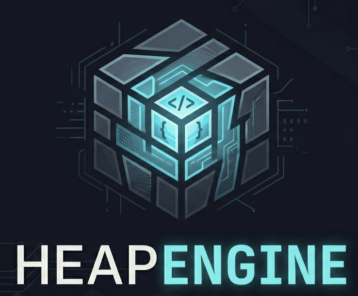

# Heap Engine



This is the engine from an game company I am starting called Heap Overflow games

## Project Structure

The project is organized into separate engine and game modules:

```
heapEngine/
├── engine/              # Engine source code
│   └── he_engine.cpp    # Engine implementation
├── game/                # Game/application source code
│   └── main.cpp         # Game entry point
├── include/             # Public headers and shared includes
│   ├── he_engine.h      # Engine public API
│   ├── vk_types.h       # Vulkan type definitions
│   └── vk_initializers.h # Vulkan initialization helpers
├── bin/                 # Build output directory (executables & object files)
├── lib/                 # Build output directory (shared libraries)
├── Makefile             # Cross-platform build system
└── README.md            # This file
```

## Build System

This project uses a cross-platform Makefile that automatically detects your operating system and builds accordingly.

### Supported Platforms

| Platform | Library Extension | Notes |
|----------|-------------------|-------|
| macOS    | `.dylib`          | Uses Homebrew for dependencies |
| Linux    | `.so`             | System package manager |
| Windows  | `.dll`            | MinGW/MSYS2 environments |

### Building

**Build everything:**
```bash
make all
```

**Build only the engine library:**
```bash
make engine
```

**Build only the game executable:**
```bash
make game
```

**Run the game:**
```bash
make run
```

**Run the game with setup script (recommended):**
```bash
./setup.sh
```

**Clean build artifacts:**
```bash
make clean
```

**Display help:**
```bash
make help
```

**Show platform and configuration info:**
```bash
make info
```

### Build Output

After building, you will have:

- **`lib/libheap_engine.dylib`** (macOS) / **`.so`** (Linux) / **`.dll`** (Windows)
  - Shared library containing the engine code
  - Linked by the game executable

- **`bin/heap_engine`**
  - Game executable that depends on the engine library
  - Can be run independently with `./bin/heap_engine`

## Platform-Specific Setup

### macOS

Homebrew is used for dependencies. Install via:

```bash
brew install glfw vulkan-loader
```

The Makefile will automatically use Homebrew paths (`/opt/homebrew/lib` and `/opt/homebrew/include`).

If you installed the Vulkan SDK manually in your home directory, set `VULKAN_SDK` before building:

```bash
export VULKAN_SDK="$HOME/VulkanSDK/<version>"
make all
```

Alternatively, use the provided setup script which automatically detects and configures the Vulkan SDK:

```bash
./setup.sh
```

### Linux

Install GLFW and Vulkan development files:

```bash
# Ubuntu/Debian
sudo apt-get install libglfw3-dev libvulkan-dev vulkan-tools

# Fedora
sudo dnf install glfw-devel vulkan-devel
```

### Windows (MinGW/MSYS2)

Install GLFW and Vulkan SDK, then ensure they're in your PATH or update the Makefile include paths:

```makefile
INCLUDES = -Iinclude -IC:/GLFW/include -IC:/VulkanSDK/*/Include
```

## How It Works

1. **Engine Compilation**: The engine source files are compiled into a shared library (`.dylib`, `.so`, or `.dll` depending on platform)
2. **Game Compilation**: The game executable is compiled and linked against the engine library
3. **Runtime**: When you run the game, the OS dynamically loads the engine library

The Makefile handles:
- Platform detection
- Platform-specific compiler flags (Position Independent Code flag for shared libraries)
- Correct library paths and linking
- Environment variables for runtime library discovery (LD_LIBRARY_PATH, DYLD_LIBRARY_PATH)

## Development

### Adding Engine Features

1. Edit source files in the `engine/` directory
2. Update `include/he_engine.h` if adding public API
3. Run `make engine` to rebuild the library

### Adding Game Code

1. Add source files in the `game/` directory
2. Run `make game` to rebuild the executable

### Building for Distribution

To create a standalone executable (optional):
```bash
# Embed the library path or ship the library alongside the executable
# This varies by platform - see platform-specific documentation
```